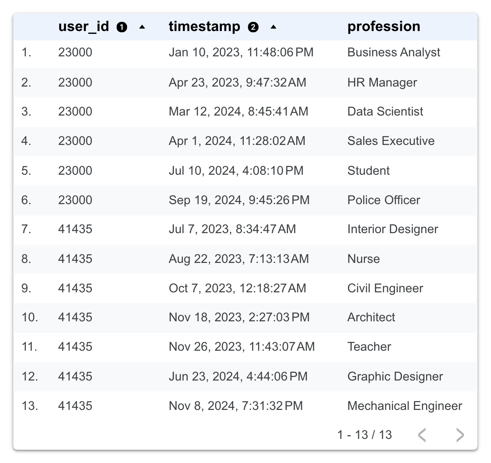
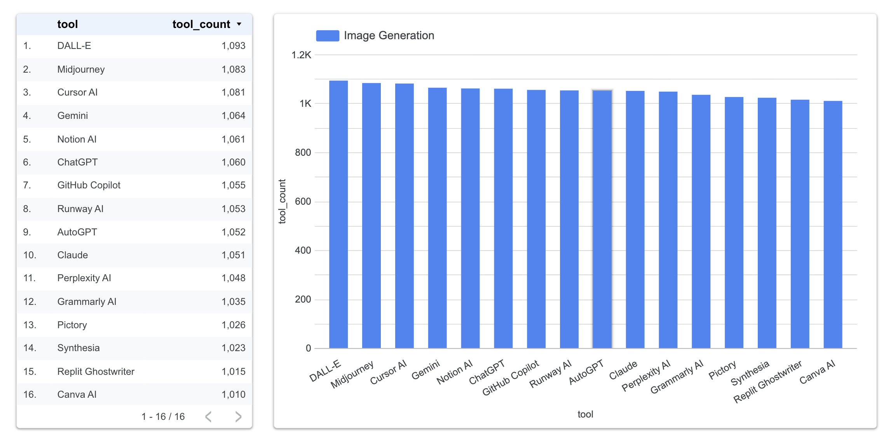
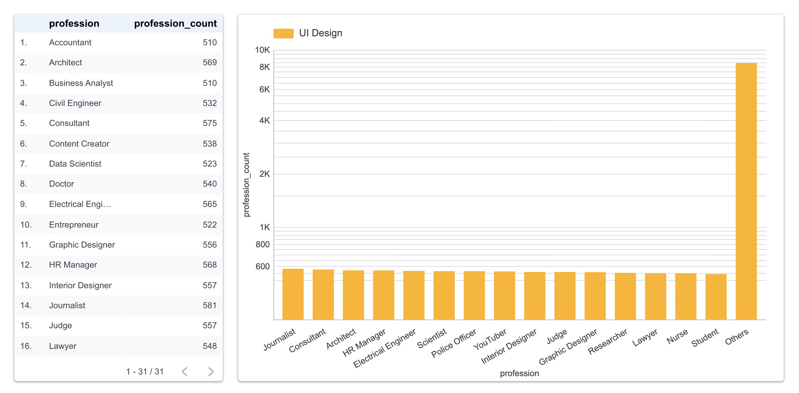
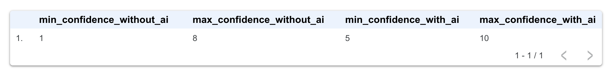
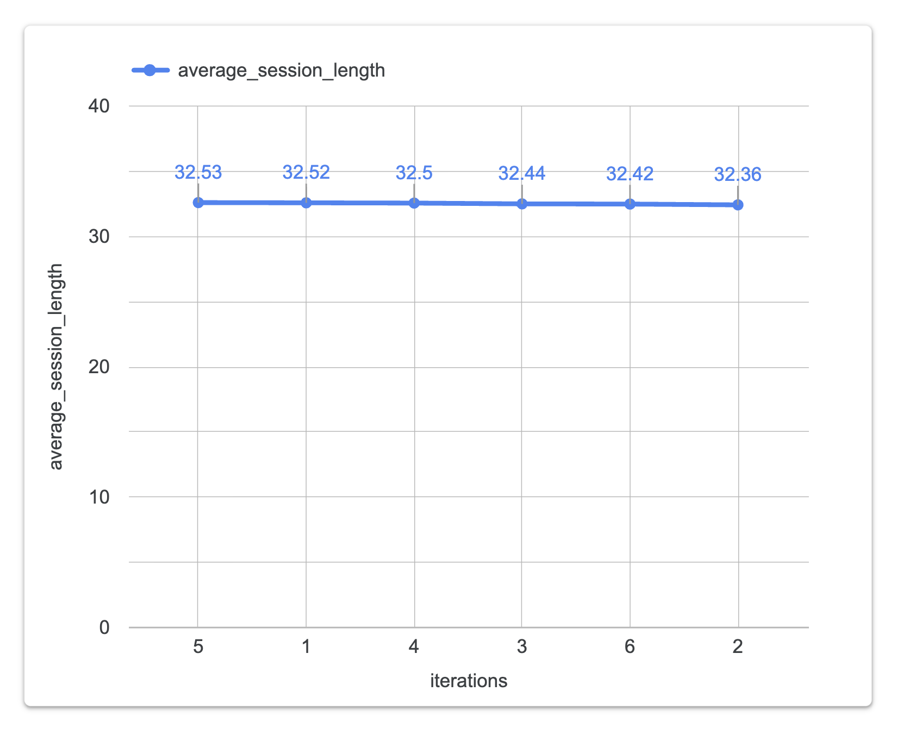
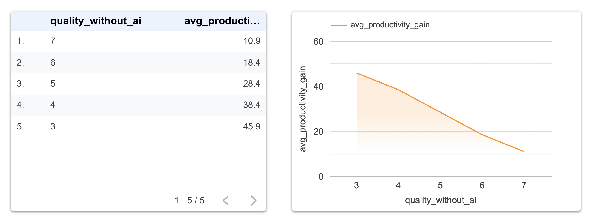
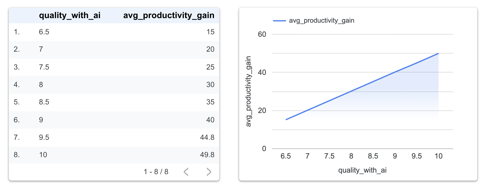

# Assessing Hidden Assumptions in a Synthetic Human-AI Dataset

## Overview

This project evaluates the structural validity of a synthetic dataset containing **1,000,000 simulated human-AI interactions**.

The objective is not to analyze AI usage behavior itself, but to examine how the dataset's variables interact and what kinds of interpretations they support. The project investigates identity, profession, tool, and behavioral variables to better understand the structure of the simulation and the relationships represented within the data.

The analysis began as a standard exploratory data analysis (EDA) project focused on AI usage patterns. As the exploration progressed, several patterns suggested that some variables might be driven more by simulation rules than by behavioral relationships. This shifted the focus toward understanding how the dataset was constructed and how its variables interact.

---

## Dataset Information

| Metric            | Value                                                 |
| ----------------- | ----------------------------------------------------- |
| Dataset Name      | AI Usage vs Output Quality Dataset                    |
| Dataset Source    | Kaggle                                                |
| Dataset Owner     | Aashyu R                                              |
| Records           | 1,000,000                                             |
| Variables         | 24                                                    |
| Missing Values    | 0%                                                    |
| Type of Data      | Synthetic (simulated dataset)                         |
| Generation Method | Rule-based simulation framework implemented in Python |
| License           | Attribution 4.0 International (CC BY 4.0)             |

Dataset link:

https://www.kaggle.com/datasets/aashyur/ai-usage-vs-output-quality-dataset

---

## Project Objectives

This project investigates:

* Whether user identities behave consistently
* Whether professions and AI tools exhibit real-world specialization
* Whether behavioral variables interact meaningfully
* Whether the dataset supports real-world interpretation
* Which assumptions may have been built into the simulation

---

## Technical Environment

* SQLite for exploratory querying and investigation
* DuckDB for validation against the complete dataset
* SQLTools for query execution and organization
* Python for visualization and supporting analysis

---

## Methodology

* Conducted a dataset audit to review documentation quality, variable definitions, and overall structure.
* Used SQLite, DuckDB, and SQLTools to investigate distributions, relationships, and consistency across variables.
* Performed exploratory analysis using the first three released batches (300,000 records) to speed up exploration and identify potential patterns.
* Validated findings against the complete 1,000,000-record dataset to confirm whether the observed patterns remained consistent.
* Compared observed relationships against expectations commonly associated with human-AI interactions.
* Visualizations and example outputs are based on the 300,000-record exploratory subset. Findings were validated against the full dataset (1,000,000 records).

**Note:** Most findings produced nearly identical patterns in both the 300,000-record subset and the full dataset. The full dataset was primarily used as a validation step rather than as a separate analysis dataset.

---

# Key Findings

## 1. User identities are not stable

The same `user_id` can appear under multiple professions across the observed time span.

**Example output:**

### Implication

`user_id` does not appear to represent persistent individuals.

As a result, analyses involving:

* career progression,
* longitudinal behavior,
* user development over time,

should be interpreted with caution.

---

## 2. Tool usage is weakly specialized across tasks

AI tools appear across a broad range of use cases regardless of their real-world purpose.

For example, GitHub Copilot ranks among the most frequently assigned tools for Image Generation despite being primarily a coding assistant.

**Example output:**

### Implication

Tool assignment appears broadly distributed across task categories, suggesting that the simulation prioritizes broad tool-task coverage over realistic specialization.

---

## 3. Profession-use case relationships appear weak

Professions appear across many task categories with relatively similar frequencies.

For example, professions such as Journalist, Consultant, Architect, HR Manager, and Electrical Engineer appear among the most common professions associated with UI Design tasks.

**Example output:**

### Implication

Profession appears to function more as a descriptive category than a strong driver of behavior.

The distribution suggests limited specialization between profession and task assignment.

---

## 4. Confidence scores are highly constrained

Confidence variables occupy unusually narrow ranges.

**Example output:**

The ranges remain identical across both the 300,000-record subset and the complete dataset.

### Implication

Confidence appears to be partially governed by simulation rules rather than emerging naturally from the interaction patterns represented in the dataset.

---

## 5. Iteration count and session length show little observable association

Iteration count shows virtually no relationship with average session length despite both variables describing aspects of user effort and interaction intensity.

**Example output:**

The relationship remains nearly identical in both the 300,000-record subset and the full dataset.

### Implication

These variables appear to have been generated independently rather than reflecting patterns that would typically be expected in real-world interactions.

---

## 6. Productivity gain behaves differently depending on the comparison used

Productivity gain appears to show different patterns depending on whether it is compared with baseline performance or AI-assisted performance.

* When compared with baseline performance, productivity gain tends to decrease as output quality increases.

**Example output:**

* When compared with AI-assisted performance, productivity gain tends to increase as output quality increases.

**Example output:**

### Implication

Productivity gain appears sensitive to how performance is measured. Different patterns emerge depending on whether comparisons are made against baseline performance or AI-assisted performance.

Unlike several other variables in the dataset, this relationship shows a more structured and internally consistent pattern.

---

# Additional Observations

## Deadline pressure appears largely independent of outcomes

Deadline pressure is distributed relatively evenly throughout the dataset and exhibits limited association with:

* session length,
* output quality,
* productivity measures.

---

## Confidence and overreliance show limited association

Average overreliance scores remain nearly constant across all confidence levels. Observed variation is minimal despite these variables representing behaviors that would normally be expected to relate to one another.

---

# Interpretation

The dataset successfully generates large-scale synthetic AI interaction records and contains several internally consistent relationships.

However, many variables that appear behavioral or identity-based show evidence of being more strongly influenced by the rules used to generate the dataset, including:

* unstable user identities,
* weak profession specialization,
* weak tool specialization,
* constrained confidence measures,
* limited association between related behavioral variables.

At the same time, some relationships appear to have been intentionally modeled, most notably the relationship between productivity gain and performance measures.

Taken together, these findings suggest that the dataset prioritizes structural completeness and broad scenario coverage over detailed modeling of real-world human behavior.

---

# Limitations

* Several variables lack detailed documentation.
* Conclusions are based solely on the released dataset rather than the underlying generation code.
* Findings evaluate structural validity and interpretability, not predictive performance.
* Some findings rely on inferred behavioral expectations rather than explicit ground truth.

---

# Conclusion

This project examined whether a large synthetic dataset of human-AI interactions supports meaningful behavioral interpretation beyond surface-level exploration.

Several relationships appeared coherent and internally consistent, particularly those involving productivity gain. However, other variables described as behavioral or contextual exhibited weak associations, broad categorical distributions, or constrained value ranges.

Overall, the findings suggest that the dataset prioritizes broad scenario coverage and structural completeness over detailed modeling of real-world human behavior. While the dataset remains valuable for educational purposes, workflow benchmarking, and exploratory analysis, users intending to conduct behavioral research should consider these structural characteristics when interpreting results.

---

# License

The code and original materials in this repository are licensed under the MIT License.

---

# Dataset Notice 

This project analyzes the AI Usage vs Output Quality Dataset by Aashyu R, which is distributed under the Creative Commons Attribution 4.0 International (CC BY 4.0) license.

The dataset is not included in this repository. Users should obtain the dataset from its original source and comply with the terms of the CC BY 4.0 license when using it.

Dataset link:

https://www.kaggle.com/datasets/aashyur/ai-usage-vs-output-quality-dataset
